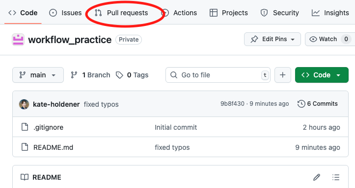
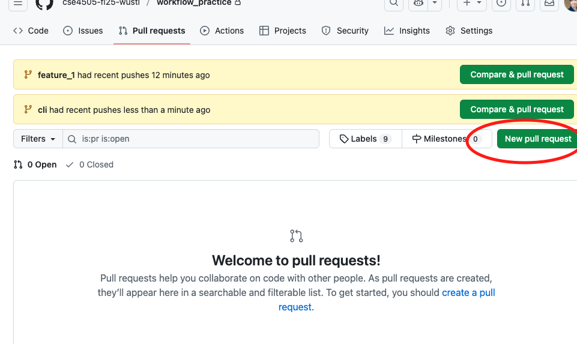
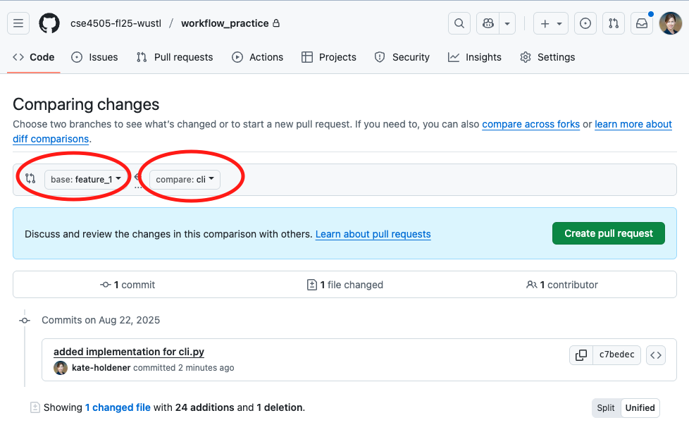
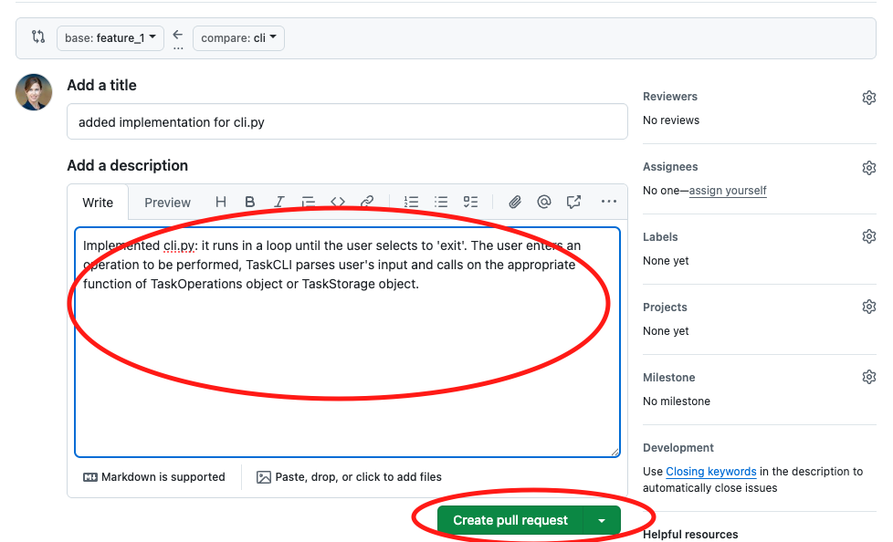
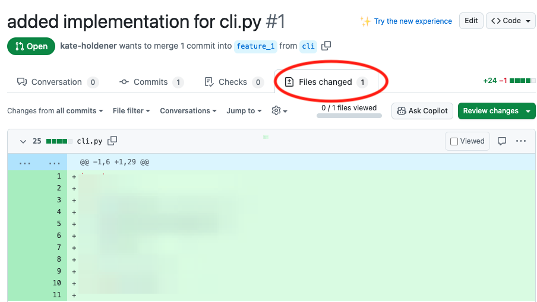
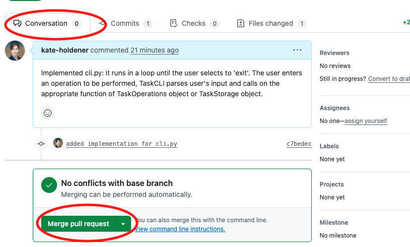

# Workflow Practice Studio
The purpose of this studio is to practice the workflow we will be using in class. Please follow the instructions closely.

In this exercise, you will build a basic command-line task manager where users can add, list, mark as complete, and delete tasks. Below is an example of how this tool would be used:

```
python cli.py add "Buy groceries"
python cli.py add "Do cse4504 homework"
python cli.py list
python cli.py complete 1
python cli.py delete 2
python cli.py save 'my_tasks.csv'
```

In this exercise, you will work through the typical steps that you will need to design and implement a specific feature of your semester project.

Typically, your team will be responsible for the design, implementation, and testing of your software features. However, to speed up the process for this studio, the design will be provided for you.

The four main components of this tool are:
1. Task - main datastructure used by this tool
1. TaskOperations -  defines possible operations on a task
1. TaskStorage - saves/retrieves tasks to/from permanent storage
1. TaskCLI - command line interface (CLI), reading and responding to user input

The components interact with each other as follows:
1. TaskCLI will initialize TaskOperations and/or TaskStorage objects
1. TaskCLI will ineract with the user, parse the user input, and call on either TaskOperations or TaskStorage to complete the request.
1. TaskOperations will perform the add/complete/delete operations
1. TaskStorage will read from/write to a file.

## Step 0
Everyone, clone the team repository to your computer.

## Step 1
Complete this step together, as a team.

1. One person from the team, create a feature branch from the main branch. Give your branch some reasonable name, for example: feature_1. To do this, from the main branch of your repository clone run:
```
git branch feature_1
git checkout feature_1
git push --set-upstream origin feature_1
```
Of course, if you name your branch something other than feature_1, you would use your branch name in these commands.

## Step 2
Everyone:
- Run `git pull` on your clone of the repository, to get the new branch.
- Run `git checkout feature_1` to switch to your new branch.

## Step 3
Complete this step together, as a team.
Typically, you would design the interfaces/contracts for the main components of your feature, and convert this design into code, leaving out the details of the implementation. The interfaces/contracts of your components are the details that other developers need to know when using your components:
- How do I instantiate this component?
- What data/variables can I access from this component?
- What functions can I call on this component?
- What arguments do I need to pass to these functions?
- What data do the functions return?

Interfaces/contracts are just a high level sketch of the components, without the detailed implementation. Of course, in order for the code to work, some kind of implementation is needed. To support this, just have your functions return some dummy value that's consistent with that function's return data type.

The interfaces you will need are defined in the files described below. Add these files to the root directory of your repository clone:

task.py
```
from datetime import date
from typing import List

class Task:
    """
    Represents a single task with description, ID, completion status, and creation date.
    
    This class has two constructors:
    1. For creating new tasks (takes description and id only)
    2. For loading existing tasks from storage (takes all parameters)
    """
    
    def __init__(self, description: str, id: int, completed: bool = None, created_date: date = None):
        """
        Constructor that handles both new task creation and loading from storage.
        
        For new tasks: Task("Do homework", 1)
        For loading: Task("Do homework", 1, True, date(2024, 1, 15))
        
        Args:
            description: What the task is about
            id: Unique identifier for the task
            completed: Whether task is done (None for new tasks, bool for loaded tasks)
            created_date: When task was created (None for new tasks, date for loaded tasks)
        """
        self.description = description
        self.id = id
        self.completed = False if completed is None else completed
        self.created_date = date.today() if created_date is None else created_date
```

storage.py
```
class TaskStorage:
    """
    Handles saving and loading tasks to/from a file.
    
    Implementation should use JSON format for simplicity.
    File format suggestion:
    [
        {"description": "Task 1", "id": 1, "completed": false, "created_date": "2024-01-15"},
        {"description": "Task 2", "id": 2, "completed": true, "created_date": "2024-01-16"}
    ]
    """
    
    def __init__(self, fileName: str):
        """
        Initialize storage with a filename.
        
        Args:
            fileName: Path to the JSON file for storing tasks
        """
        self.fileName = fileName
    
    def load_tasks(self) -> List[Task]:
        """
        Load all tasks from the storage file.
        
        Should handle the case where file doesn't exist (return empty list).
        Should parse JSON and convert date strings back to date objects.
        
        Returns:
            List of Task objects loaded from file
        """
        return []
    
    def save_tasks(self, tasks: List[Task]):
        """
        Save all tasks to the storage file.
        
        Should convert Task objects to JSON format.
        Should convert date objects to strings for JSON serialization.
        Should handle file creation if it doesn't exist.
        
        Args:
            tasks: List of Task objects to save
        """
        pass


```

operations.py
```
class TaskOperations:
    """
    Handles all task manipulation operations (add, complete, delete, list).
    
    This class maintains the in-memory list of tasks and provides methods
    to modify them. It should work with TaskStorage to persist changes.
    """
    
    def __init__(self, tasks: List[Task]):
        """
        Initialize with a list of tasks (usually loaded from storage).
        
        Args:
            tasks: Initial list of tasks
        """
        self.tasks = tasks
        self.next_id = max([task.id for task in tasks], default=0) + 1
    
    def add_task(self, description: str) -> Task:
        """
        Create a new task with the given description.
        
        Should automatically assign a unique ID (use self.next_id).
        Should add the task to self.tasks list.
        Should increment self.next_id for next task.
        
        Args:
            description: What the task is about
            
        Returns:
            The newly created Task object
        """
        return None
    
    def complete_task(self, task_id: int) -> bool:
        """
        Mark a task as completed by its ID.
        
        Should find the task with matching ID and set completed=True.
        
        Args:
            task_id: ID of the task to complete
            
        Returns:
            True if task was found and completed, False if task ID not found
        """
        return False
    
    def delete_task(self, task_id: int) -> bool:
        """
        Remove a task from the list by its ID.
        
        Should find and remove the task with matching ID from self.tasks.
        
        Args:
            task_id: ID of the task to delete
            
        Returns:
            True if task was found and deleted, False if task ID not found
        """
        return False
    
    def list_tasks(self) -> List[Task]:
        """
        Return all current tasks.
        
        Returns:
            List of all Task objects
        """
        return self.tasks


```
cli.py
```
class TaskCLI:
    """
    Command-line interface for the task tracking application.
    
    Should provide a menu-driven interface with options to:
    - Add new task
    - List all tasks  
    - Complete a task
    - Delete a task
    - Quit
    
    Should integrate TaskStorage and TaskOperations classes.
    Should load tasks on startup and save on exit or after each operation.
    """
    
    def __init__(self):
        """
        Initialize the CLI.
        
        Should create TaskStorage instance (suggest filename: "tasks.json")
        Should load tasks from storage
        Should create TaskOperations instance with loaded tasks
        """
        pass
    
    def run(self):
        """
        Main program loop.
        
        Should display a menu with options:
        1. Add task
        2. List tasks  
        3. Complete task
        4. Delete task
        5. Quit
        
        Should handle user input and call appropriate TaskOperations methods.
        Should save tasks after each modification.
        Should continue looping until user chooses to quit.
        
        Example interaction:
        === Task Manager ===
        1. Add task
        2. List tasks
        3. Complete task  
        4. Delete task
        5. Quit
        Choice: 1
        Enter task description: Do homework
        Task added successfully!
        
        For list tasks, show format like:
        ID: 1 | Description: Do homework | Status: Pending | Created: 2024-01-15
        """
        pass
   def run(self):
      pass

if __name__ == '__main__':
    cli = TaskCLI()
    cli.run()
```

Commit and push your code. Since you have checked out the feature branch in step 2, you will be committing the code into the feature branch.
```
git add <FILE(S) YOU WANT TO COMMIT>
git commit -m 'adding interfaces for task tracker'
git push
```

# Step 4
As a team, divide up the work of implementing cli.py, operations.py, and storage.py

# Step 5
Individually, everyone run `git pull` to update your feature_1 branch. Create another branch for your individual work (that branches off feature_1):
```
git branch <YOUR_BRANCH_NAME>
git checkout <YOUR_BRANCH_NAME>
```
Replace <YOUR_BRANCH_NAME> with some meaningful name. Don't use your name, instead, use the name of the file you'll be implementing. For example `cli` or `operations`.

In your branch, implement the code in your assigned file. Feel free to use AI coding assistant here. When you are finished, commit and push your code:
```
git add <FILES YOU WANT TO STAGE FOR COMMIT>
git commit -m 'added implementation for YOUR_FILE'
git push --set-upstream origin <YOUR_BRANCH_NAME>
```

This makes your branch available in the remote repository (in your team GitHub repository).

# Step 6
Individually, create a pull request from your branch to feature_1 branch. This pull request is a request to merge your changes to feature_1. To do this:
1. Go to your team GitHub repository
1. Go to the Pull requests menu. 
1. Click on the "New pull request" button. 
1. Select your branch as the source and feature_1 as destination of this PR. 
1. Add a description of what this pull request accomplishes and how, submit hte PR. 
1. Look at 'Files changed' tab to review changes in a PR. 

# Step 7
As a team, review everyone's PR by opening each PR from the "Pull requests" menu and examining the details in the "Files changed". If any changes are needed, the author of the PR can commit and push the necessary changes to their branch. The PR will get updated with those changes automatically. If all the changes in the PR look acceptable, merge the PR using the "Merge pull request" button. 

# Step 8
Everyone, check out feature_1 branch
When everyone's PR has been merged to feature_1 branch, everyone check out feature_1 branch and pull the latest changes:
```
git checkout feature_1
git pull
```
From there, run  cli.py and see if it works. There is a good chance that it won't work on the first try. If it doesn't work, together figure out why and fix the problems. Commit and push all your changes to feature_1 branch.

When you get cli.py to work in feature_1 branch, have one person from your team create a pull request with feature_1 as the source and main as the destination. This process will be very similar to the process described in step 6.

# General Workflow
Steps 1 through 8 were an example of the workflow we will use in this class. Describe this workflow in general terms (add your workflow description into this section of README.md).
